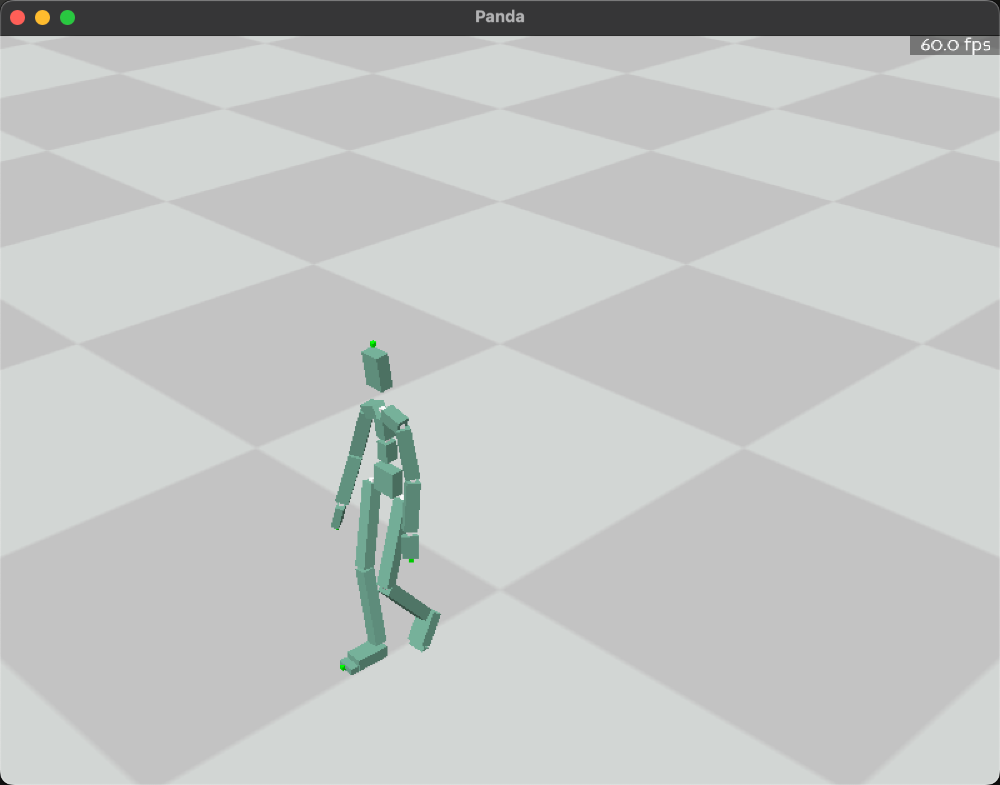
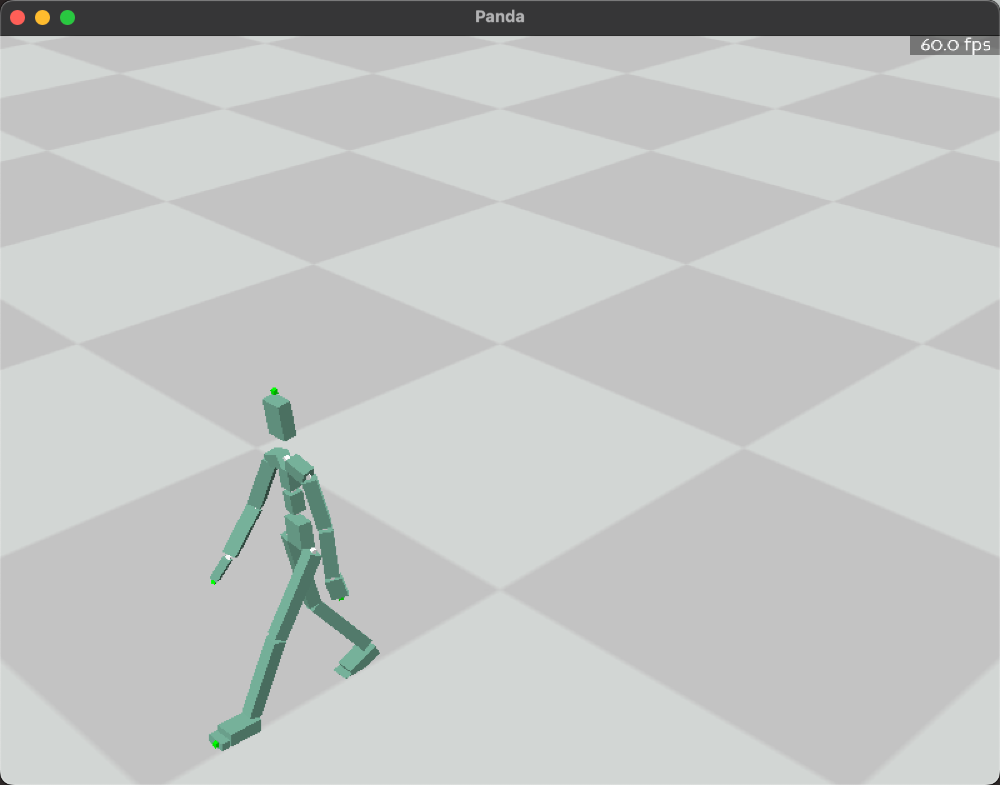
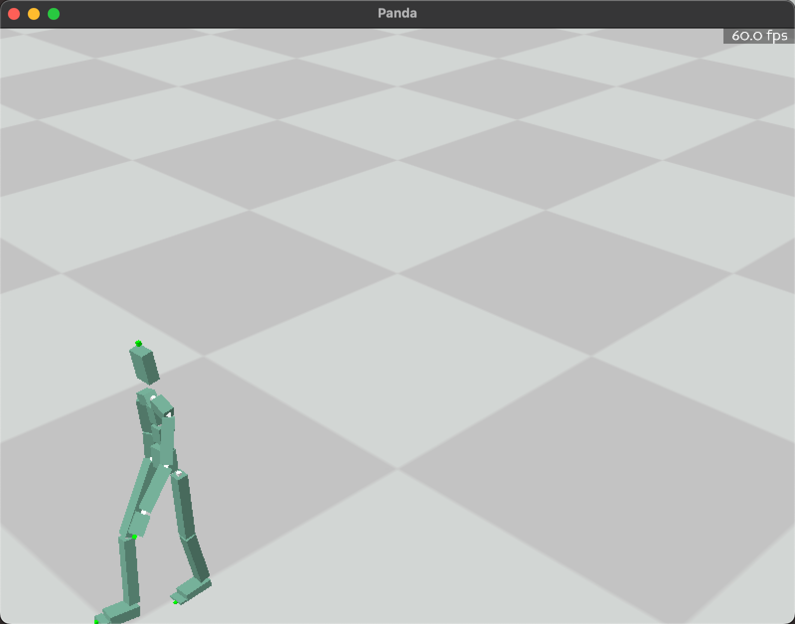

_Ruitian Yang_  
_No. 3036410718_

---

## Task 1 - Keyframing Animation

I implemented interpolation to generate smooth transitions between keyframes. Positional data used **linear interpolation**, and rotational data was handled with **Slerp** from `scipy.spatial.transform`. The linear interpolation followed:

\[
\text{data\_between} = \text{left\_data} + (\text{right\_data} - \text{left\_data}) \times \left(\frac{i}{t}\right)
\]

For rotations, **Slerp** ensured smooth transitions between quaternions. I tested various time steps and target steps, observing that fewer target steps sped up the animation, while more target steps slowed it down.

### Performance with Time Steps and Target Steps

- **Time Step = 10, Target Step = 5**:  
  Faster animation with fewer interpolated frames. The walking motion was quicker, yet remained smooth due to Slerp.

- **Time Step = 10, Target Step = 10**:  
  Balanced speed and fluidity with natural transitions.

- **Time Step = 10, Target Step = 20**:  
  Slower animation with more interpolated frames, causing a stretched-out walking motion.

- **Time Step = 10, Target Step = 30**:  
  Very slow animation, with excessive interpolation causing sluggish motion.

### Conclusion

Fewer target steps lead to faster, responsive animations. More target steps slow down motion but improve smoothness. Optimizing **time step** and **target step** is key for balancing speed and fluidity.

### Screenshots





---

## Task 2 - Motion Concatenation

I concatenated walking and running motions using a **similarity matrix** based on Euclidean distance to match frames. After aligning root positions, I tested **linear interpolation** and **inertialization**. Inertialization, using a spring-damper system, smoothed abrupt velocity changes.

### Key Observations

- **Linear interpolation**: Basic transitions but struggled with velocity changes.
- **Inertialization**: Smoother transitions with continuous velocity and gradual blending.

### Results

Refer to the recorded video (motion_concat.mp4).

---

## Task 3 - Motion Matching

I implemented motion matching using selected features to ensure realistic transitions. Features such as **hipRot**, **foot and hand positions**, and **future trajectory data** were considered. These features were weighted to prioritize rotations and limb positions for natural transitions.

### Feature Selection

The following features were selected and weighted:

```python
selected_feature_names = [
    'hipRot', 'lFootPos', 'rFootPos', 'lHandPos', 'rHandPos', 
    'trajectoryPos2D', 'trajectoryRot2D'
]
selected_feature_weights = [1.5, 1.0, 1.0, 1.0, 1.0, 0.5, 0.5]
```

### Analysis

- **hipRot**: Essential for stable, grounded motion. Without it, the character would misalign, leading to unnatural transitions.
- **Foot and hand positions**: Ensure realistic limb movement, preventing disjointed actions.
- **Trajectory data**: Guides future movements, making transitions smoother. Reducing the weight of trajectory data makes the motion reactive but less fluid.

### Results

The weighted features produced realistic transitions, especially in the hip and limbs, while trajectory data improved motion anticipation. 

Refer to the recorded video (motion_matching.mp4).

---

## Experimental Results with Different Parameters

### Task 1 - Keyframing Animation

- **Time Step = 10, Target Step = 5**: Fast animation with quick transitions but slightly less detailed.
- **Time Step = 10, Target Step = 20**: Slower animation with smoother transitions.
- **Time Step = 10, Target Step = 30**: Very slow, impractical for real-time applications.

### Task 2 - Motion Concatenation

- **Linear interpolation**: Struggled with abrupt changes in velocity.
- **Inertialization**: Provided smooth, continuous transitions, especially when dealing with different velocities.

### Task 3 - Motion Matching

- **Increased `hipRot` weight (1.5)**: Improved motion stability, reducing abrupt directional changes.
- **Decreased trajectory weights (0.5)**: Reduced smoothness but increased responsiveness.
- **Equal limb weights (1.0)**: Balanced hand and foot movements, ensuring natural limb coordination.

---

## Reflections on Producing High-Quality Motion

For high-quality motion, balancing smoothness, responsiveness, and natural transitions is essential:

1. **Task 1**: Fewer target steps yield faster animations, while more steps provide smoother transitions. **Slerp** significantly aids in rotational interpolation.
2. **Task 2**: **Inertialization** is vital for seamless transitions, especially between motions with different velocities.
3. **Task 3**: Proper **feature weighting** is crucial. **hipRot** ensures stability, while trajectory data improves smoothness. Adjusting weights based on scenario improves motion quality.

### Future Considerations

- **Dynamic weight adjustments**: Adapting feature weights based on motion type or gameplay could enhance responsiveness and realism.
- **Adaptive interpolation**: Use fewer interpolated frames for simple motions, and more for complex ones to optimize visual quality and performance.
